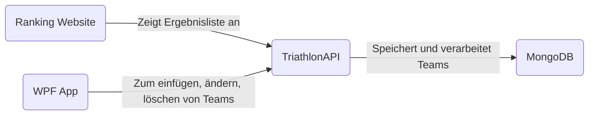

# TriathlonAPI
TriathlonAPI ist mein diesjähriges POS Semester Projekt. Der größte Teil besteht dabei aus einer REST-API in Verbindung mit einer Website und einer WPF-Anwendung. Die Anforderungen waren zwei Clients welche auf die API zugreifen.

Zu Stande kam meine Idee durch folgendes. Letztes Jahr startete unsere Klasse ein Projekt für den Sportunterricht, in dem wir einen Triathlon organisieren sollten. Ein Team war dabei beauftragt eine Website zu erstellen für die Anmeldung und die Ergebnisliste. Dabei fiel mir ein Mangel auf. Die Ergebnisauswertung wurde sehr mühsam in Excel durchgeführt. Deswegen hab ich es mir zum Ziel gesetzt eine Website zu schaffen welche die Liste schön und ordentlich für jeden erreichbar macht und auch eine Erleichterung bei der Eingabe der Ergebnisse für alle Teilnehmer.

## Inhaltsverzeichnis

## Software Design

#### TriathlonAPI
Das Herzstück des Projektes ist die API. Sie wurde in Java in der IDE IntelliJ programmiert und basiert auf das Spring Boot Framework. Sie ist für das speichern und verwalten der Daten, in meinem Fall die Teams, zuständig.

#### Website
Die Website dient zur Wiedergabe der gespeicherten Daten, welche einen guten Überblick über die Teams und wie sie im Ranking stehen gibt. Benutzt hab ich dabei Visual Studio Code mit HTML, CSS und JavaScript.

#### WPF-Anwendung
Die WPF dient in meinem Fall für das hinzufügen, ändern und löschen der Teams. Dabei war der Gedanke eine benutzerfreundliche Oberfläche zu schaffen welche für jeden verwendbar ist.

## Beschreibung der Software
#### TriathlonAPI
Wie oben bereits erwähnt benutze ich das Spring Boot Framework. Dabei verwendete ich das Kommandozeilenwerkzeug Maven und dementsprechend die folgenden Dependencies.
~~~xml
<dependencies>  
  
   <dependency>      <groupId>org.springframework.boot</groupId>  
      <artifactId>spring-boot-starter-web</artifactId>  
   </dependency>  
   <dependency>      <groupId>org.springframework.boot</groupId>  
      <artifactId>spring-boot-starter-actuator</artifactId>  
   </dependency>   <dependency>      <groupId>org.springframework.boot</groupId>  
      <artifactId>spring-boot-starter-data-mongodb</artifactId>  
   </dependency>  
   <dependency>      <groupId>org.springframework.boot</groupId>  
      <artifactId>spring-boot-starter-test</artifactId>  
      <scope>test</scope>  
   </dependency>   <dependency>      <groupId>com.vaadin.external.google</groupId>  
      <artifactId>android-json</artifactId>  
      <version>0.0.20131108.vaadin1</version>  
      <scope>compile</scope>  
   </dependency></dependencies>
~~~
Um die API zu benutzten braucht es sogenannte Endpoints welche sich selbst für den jeweiligen Nutzten programmieren lassen.

~~~java 
@RequestMapping(method= RequestMethod.POST, value="/addTeam")  
public String addTeam(@RequestBody TeamDaten team) {  
    triathlonService.addTeam(team);  
    System.out.println(team.toString());  
    String response = "{\"success\": true, \"message\": Team has been added successfully.}";  
    return response;  
}
~~~
Als Beispiel sieht man im obigen Code den Endpoint für das hinzufügen eines Teams. Unter dem Punkt **blabla** wird dies noch genauer beschrieben.

#### Website
Bei der Website habe ich mich für ein simples Dark Mode Design entschieden. Welche wie in [Software Design](##Software-Design) bereits genannt in HTML, CSS und JavaScript erstellt wurde. 

##### "fetchen" der Daten für Website
~~~JS
async function fetchAndProcessData() {

  try {

    const response = await fetch('http://localhost:6969/daten');

    const data = await response.json();

  

    data.sort((a, b) => parseFloat(a._gesamtZeit) - parseFloat(b._gesamtZeit));

  

    const rankingList = document.getElementById('ranking-list');

    const header = document.createElement('li');

    header.classList.add('header');

    header.innerHTML = `

      Position

      

      Gesamtzeit

    `;

    rankingList.appendChild(header);

  

    let currentPosition = 1;

    let previousTime = null;

  

    data.forEach((team, index) => {

      const { _teamName, _gesamtZeit } = team;

  

      const listItem = document.createElement('li');

  

      if (_gesamtZeit !== previousTime) {

        currentPosition = index + 1;

        previousTime = _gesamtZeit;

      }

  

      const teamName = document.createElement('span');

      teamName.classList.add('name', 'teamname');

      teamName.setAttribute('data-text', _teamName);

      teamName.textContent = _teamName;

  

      listItem.innerHTML = `

        ${getPositionText(currentPosition)}

        ${currentPosition === 1 ? '' : ''}

        ${teamName.outerHTML}

        ${parseFloat(_gesamtZeit).toFixed(2)} minutes

      `;

  

      rankingList.appendChild(listItem);

    });

  } catch (error) {

    console.error('Error:', error);

  }

}

~~~
In der obigen Funktion hol ich mir alle Teams aus der API welche dann mittels der berechneten Gesamtzeit die sich aus Laufzeit, Radfahrzeit und Schwimmzeit zusammensetzt sortiert. Anschließend werden die Teamdaten ausgelesen und sortiert in eine Liste hinzugefügt und der Teamname die Position und die Gesamtzeit angezeigt.

##### Get Position
~~~JS
function getPositionText(position) {

  if (position === 1) {

    return '1st';

  } else if (position === 2) {

    return '2nd';

  } else if (position === 3) {

    return '3rd';

  } else {

    return `${position}th`;

  }

}

  

function getPositionClass(position) {

  if (position === 1) {

    return 'gold';

  } else if (position === 2) {

    return 'silver';

  } else if (position === 3) {

    return 'bronze';

  } else {

    return 'normal';

  }

}
~~~
In den beiden Funktionen getPositionClass und getPositionText wird für die Anzeige der Position in dem sich die jeweiligen Teams befinden unterschieden in Erster, Zweiter, Dritter und Rest. In diesen Funktionen werden die Klassen zurückgegeben welche dann für das stylen der Website behilflich sind.

#### WPF Anwendung
WPF ist ein Grafik-Framework von Windows womit man kleine Applikationen in C# programmieren kann. Bei meinem Projekt verwende ich eine WPF Anwendung um Daten für den Triathlon hinzuzufügen, entfernen und ändern kann. 

##### Add
~~~c#
    private async void Submit_Click(object sender, RoutedEventArgs e)
        {
            var input = new
            {
                _teamName = "",
                _schwimmZeit = 0.0f,
                _radZeit = 0.0f,
                _laufZeit = 0.0f,
                _gesamtZeit = 0.0f
            };
            try
            {
                teamName = TeamNameTextBox.Text;
                laufzeit = float.Parse(LaufzeitTextBox.Text);
                schwimmzeit = float.Parse(SchwimmzeitTextBox.Text);
                radzeit = float.Parse(RadzeitTextBox.Text);

                input = new
                {
                    _teamName = teamName,
                    _schwimmZeit = schwimmzeit,
                    _radZeit = radzeit,
                    _laufZeit = laufzeit,
                    _gesamtZeit = laufzeit + schwimmzeit + radzeit
                };

                 inputJson = JsonConvert.SerializeObject(input);

                TeamNameTextBox.Text = null;
                LaufzeitTextBox.Text = null;
                SchwimmzeitTextBox.Text = null;
                RadzeitTextBox.Text = null;

                inputs.Add(inputJson);

                //InputList.Items.Add(inputJson);
             

            }
            catch(Exception ex)
            {
               MessageBox.Show("Ungültiges Format für Zeiten. Bitte [Minuten, Sekunden]", "Save error", MessageBoxButton.OK, MessageBoxImage.Error);
                LaufzeitTextBox.Text = null;
                SchwimmzeitTextBox.Text = null;
                RadzeitTextBox.Text = null;
            }

            using (var client = new HttpClient())
            {
                client.BaseAddress = new Uri("http://localhost:6969");
               
             
                Console.WriteLine(inputJson);
            
                var result = await client.PostAsJsonAsync("http://localhost:6969/addTeam", input);
                string resultContent = await result.Content.ReadAsStringAsync();
                Console.WriteLine(resultContent);
                InputList.Items.Add(resultContent);
            }

        }
        ~~~
Bei meiner Add Funktion hab ich meiner WPF vier Textfelder gegeben in welchen der Teamname, die Schwimm/Rad/Lauf - Zeiten eingegeben werden können. Anschließend konvertiere ich diese Daten in ein JSON Objekt und schicke sie per *POST* Request and den API Endpoint *addTeam*.

##### Delete
~~~c#
private async void DeleteButton_Click(object sender, RoutedEventArgs e)
        {
            if (DeleteTeamComboBox.SelectedItem != null)
            {
                try
                {
                    TeamDaten selectedTeam = (TeamDaten)DeleteTeamComboBox.SelectedItem;
                    string id = selectedTeam._id; 

                    using (var client = new HttpClient())
                    {
                        client.BaseAddress = new Uri("http://localhost:6969");

                        var result = await client.DeleteAsync($"http://localhost:6969/deleteTeam/{id}"); 
                        string resultContent = await result.Content.ReadAsStringAsync();
                        Console.WriteLine(resultContent);
                        DeleteSuccessMessageTextBlock.Visibility = Visibility.Visible;
                        DeleteTeamComboBox.SelectedIndex = -1;
                    }
                }
                catch (Exception ex)
                {
                    MessageBox.Show("An error occurred while deleting the team.", "Delete error", MessageBoxButton.OK, MessageBoxImage.Error);
                }
            }
        }
~~~
Bei der Delete Funktion hat man ein Dropdown Menü bei welchem man zwischen allen Teams das zu löschende Team ausgewählt werden kann. Anschließend wird dieses mit einer *DELETE* Request an den Endpoint *deleteTeam* mit der jeweiligen Team ID übergeben und aus der Datenbank gelöscht. 

##### Update
~~~c#
private async void UpdateButton_Click(object sender, RoutedEventArgs e)
        {
            if (TeamComboBox.SelectedItem != null)
            {
                try
                {
                    TeamDaten selectedTeam = (TeamDaten)TeamComboBox.SelectedItem;
                    string id = selectedTeam._id; 
                    selectedTeam.TeamName = UpdateTeamNameTextBox.Text;
                    selectedTeam._laufZeit = float.Parse(UpdateLaufzeitTextBox.Text);
                    selectedTeam._schwimmZeit = float.Parse(UpdateSchwimmzeitTextBox.Text);
                    selectedTeam._radZeit = float.Parse(UpdateRadzeitTextBox.Text);
                    selectedTeam._gesamtZeit = selectedTeam._laufZeit + selectedTeam._schwimmZeit + selectedTeam._radZeit;

                    using (var client = new HttpClient())
                    {
                        client.BaseAddress = new Uri("http://localhost:6969");

                        var input = new
                        {
                            _teamName = selectedTeam.TeamName,
                            _schwimmZeit = selectedTeam._schwimmZeit,
                            _radZeit = selectedTeam._radZeit,
                            _laufZeit = selectedTeam._laufZeit,
                            _gesamtZeit = selectedTeam._gesamtZeit
                        };

                        string inputJson = JsonConvert.SerializeObject(input);

                        var result = await client.PutAsJsonAsync($"http://localhost:6969/updateTeam/{id}", input); 
                        string resultContent = await result.Content.ReadAsStringAsync();
                        Console.WriteLine(resultContent);
                        InputList.Items.Add(resultContent);
                        UpdateSuccessMessageTextBlock.Visibility = Visibility.Visible;
                        UpdateTeamNameTextBox.Text = null;
                        UpdateLaufzeitTextBox.Text = null;
                        UpdateSchwimmzeitTextBox.Text = null;
                        UpdateRadzeitTextBox.Text = null;
                    }
                    
                }
                catch (Exception ex)
                {
                    MessageBox.Show("Ungültiges Format für Zeiten. Bitte [Minuten, Sekunden]", "Update error", MessageBoxButton.OK, MessageBoxImage.Error);
                    UpdateLaufzeitTextBox.Text = null;
                    UpdateSchwimmzeitTextBox.Text = null;
                    UpdateRadzeitTextBox.Text = null;
                }
            }
        }
~~~
Das updaten eines Teams funktioniert ähnlich wie Delete. Der unterschied ist hierbei das man nach dem auswählen seines Teams jegliche Zeiten oder auch den Teamnamen beliebig ändern kann. Nach dem ändern wird das Team per *PUT* Request an den API Endpoint *updateTeam* mit der jeweiligen Team ID gesendet.
